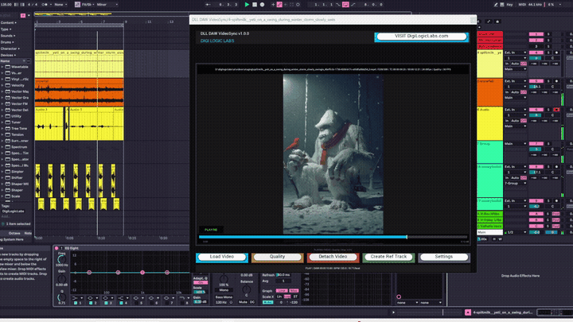

# DLL DAW VideoSync

A free, open-source video transport plugin for DAWs by [Digi Logic Labs LLC](https://digilogiclabs.com). Supports VST3, CLAP, Audio Unit (AUv2/AUv3), AAX, VST2, and standalone formats via [iPlug2](https://github.com/iPlug2/iPlug2).

Load a video file (.mp4, .mov, .avi) in your DAW and it syncs playback to the host timeline — built for sound designers, composers, and post-production workflows.



## Download (Pre-Built)

If you just want to use the plugin without building from source, grab the latest release:

### Option 1: GitHub Releases (Recommended)

Download from the [Releases](../../releases) page. Each release includes the pre-built `.vst3` file for Windows x64.

### Option 2: Direct from Repo

A pre-built binary is included in this repository:

1. Download [`releases/v1.0.0/DLLDAWVideoSync.vst3`](releases/v1.0.0/DLLDAWVideoSync.vst3)
2. Copy it to your VST3 folder:
   ```
   C:\Program Files\Common Files\VST3\
   ```
3. Restart your DAW and scan for new plugins

### Option 3: From Our Website

Visit [digilogiclabs.com](https://digilogiclabs.com) for the latest download links and documentation.

## Installation

1. Copy `DLLDAWVideoSync.vst3` into your system VST3 directory:
   ```
   C:\Program Files\Common Files\VST3\
   ```
2. Open your DAW (Ableton Live, FL Studio, Reaper, etc.) and rescan plugins if needed
3. Add **DLL DAW VideoSync** to any track
4. Click **Open** to select a video file
5. Press play — the video follows the DAW timeline

## Features

- Frame-accurate video sync to DAW transport (play, pause, seek)
- SMPTE timecode display (non-drop and drop-frame 29.97)
- Multiple performance modes (Ultra HD, HD, Quality, Balanced, Performance, Preview)
- Floating video window with fullscreen support (double-click to toggle)
- Windows Media Foundation decoding (built-in, no extra installs needed)
- Optional VLC SDK backend for broader codec support
- Reference audio track extraction from video
- Video metadata display (codec, resolution, frame rate, bitrate)
- BPM-to-frame grid analysis
- State serialization (video path saved with your DAW session)
- Supports .mp4, .mov, .avi, .mkv, .wmv, .webm formats

## Supported Platforms and Formats

| Format | Windows (x64) | macOS | iOS |
|--------|:---:|:---:|:---:|
| **VST3** | Built & tested | Xcode project included | — |
| **CLAP** | Project included | Xcode scheme included | — |
| **Audio Unit (AUv2)** | — | Xcode scheme included | — |
| **AUv3 (App Extension)** | — | Xcode scheme included | Xcode project included |
| **AAX** | Project included | Xcode scheme included | — |
| **VST2** | Project included | Xcode scheme included | — |
| **Standalone App** | Project included | Xcode scheme included | Xcode project included |
| **WAM (Web Audio)** | — | Makefile included | — |

**Pre-built binary:** Windows x64 VST3 only (see [Releases](../../releases)).

**Tested and confirmed:** Ableton Live on Windows x64. Should work in any VST3-compatible DAW including FL Studio, Reaper, Cubase, Studio One, Bitwig, and others. macOS and iOS builds require Xcode and have not yet been tested — contributions welcome.

## Building from Source

### Prerequisites (All Platforms)

- **iPlug2** framework — the project expects iPlug2 at `../../external/iPlug2` relative to this folder:
  ```bash
  # From the parent directory of this repo
  mkdir -p external
  cd external
  git clone https://github.com/iPlug2/iPlug2.git
  cd iPlug2
  git submodule update --init --recursive
  ```
- **VST3 SDK** — place the Steinberg VST3 SDK inside iPlug2's dependencies:
  ```
  external/iPlug2/Dependencies/IPlug/VST3_SDK/
  ```
  This directory should contain `pluginterfaces/`, `public.sdk/`, and a `CMakeLists.txt`. You can download the SDK from [Steinberg's developer portal](https://www.steinberg.net/developers/) or use the iPlug2 download script.

### Windows (Visual Studio)

**Requires:** Visual Studio 2022 (or later) with the C++ desktop development workload.

1. Open `DLLDAWVideoSync.sln` in Visual Studio 2022
2. Select **Release | x64** from the configuration dropdown
3. Build the **DLLDAWVideoSync-vst3** project (right-click > Build)
4. The compiled plugin will appear at:
   ```
   build-win/vst3/x64/Release/DLLDAWVideoSync.vst3
   ```
5. The post-build script automatically bundles it into the VST3 bundle format at:
   ```
   build-win/DLLDAWVideoSync.vst3/Contents/x86_64-win/DLLDAWVideoSync.vst3
   ```

Other Windows build targets available in the solution: `DLLDAWVideoSync-clap`, `DLLDAWVideoSync-vst2`, `DLLDAWVideoSync-aax`, `DLLDAWVideoSync-app` (standalone).

**Install:** Copy the built `.vst3` file to `C:\Program Files\Common Files\VST3\`

### macOS (Xcode)

**Requires:** Xcode with command-line tools installed.

1. Open `projects/DLLDAWVideoSync-macOS.xcodeproj` in Xcode
2. Select a scheme from the scheme dropdown — available schemes:
   - **macOS-VST3**, **macOS-AUv2**, **macOS-AUv3**, **macOS-CLAP**, **macOS-VST2**, **macOS-AAX**, **macOS-APP** (standalone)
   - **All macOS** (builds all formats at once)
3. Build with **Product > Build** (Cmd+B)

**Install:** Copy the built `.vst3` to `~/Library/Audio/Plug-Ins/VST3/` or the `.component` to `~/Library/Audio/Plug-Ins/Components/`

### iOS (Xcode)

1. Open `projects/DLLDAWVideoSync-iOS.xcodeproj` in Xcode
2. Select the **iOS-APP with AUv3** or **iOS-AUv3** scheme
3. Build for a device or simulator

### Optional: VLC SDK for Extended Codec Support

By default, the plugin uses Windows Media Foundation for video decoding, which handles most common formats. For broader codec support:

1. Install [VLC Media Player](https://www.videolan.org/vlc/) (64-bit) or download the VLC developer SDK
2. Open `VLC_Config.h` and uncomment `#define USE_VLC_SDK`
3. Rebuild the project

See [`setup_vlc_sdk.md`](setup_vlc_sdk.md) for detailed VLC SDK integration instructions.

## Project Structure

```
DLLDAWVideoSync/
├── DLLDAWVideoSync.h           # Plugin header (main class)
├── DLLDAWVideoSync.cpp          # Plugin implementation (~2500 lines)
├── config.h                     # iPlug2 plugin configuration
├── VLC_Config.h                 # VLC SDK toggle and config
├── setup_vlc_sdk.md             # Detailed VLC SDK setup guide
├── DLLDAWVideoSync.sln          # Visual Studio solution (Windows)
├── DLLDAWVideoSync.xcworkspace/ # Xcode workspace (macOS)
├── config/                      # Platform-specific build configs
│   ├── DLLDAWVideoSync-win.props
│   ├── DLLDAWVideoSync-mac.xcconfig
│   └── DLLDAWVideoSync-ios.xcconfig
├── projects/                    # IDE project files
│   ├── DLLDAWVideoSync-vst3.vcxproj      # Windows VST3
│   ├── DLLDAWVideoSync-clap.vcxproj      # Windows CLAP
│   ├── DLLDAWVideoSync-vst2.vcxproj      # Windows VST2
│   ├── DLLDAWVideoSync-aax.vcxproj       # Windows AAX
│   ├── DLLDAWVideoSync-app.vcxproj       # Windows standalone
│   ├── DLLDAWVideoSync-macOS.xcodeproj/  # macOS (all formats)
│   ├── DLLDAWVideoSync-iOS.xcodeproj/    # iOS AUv3
│   ├── DLLDAWVideoSync-wam-*.mk          # Web Audio Module
│   ├── config/                            # Per-project build configs
│   ├── scripts/                           # Build helper scripts
│   └── resources/                         # Fonts and assets
├── scripts/                     # Build and packaging scripts
│   ├── postbuild-win.bat
│   ├── prebuild-win.bat
│   ├── prepare_resources-*.py   # Resource prep (win, mac, ios)
│   └── makedist-web.sh
├── resources/                   # UI resources, icons, plists
│   ├── DLLDAWVideoSync.ico      # Windows icon
│   ├── DLLDAWVideoSync.icns     # macOS icon
│   ├── main.rc                  # Windows resource script
│   ├── *-Info.plist             # macOS/iOS bundle info
│   └── Images.xcassets/         # iOS app icons
├── releases/                    # Pre-built binaries
│   └── v1.0.0/DLLDAWVideoSync.vst3
├── LICENSES/                    # Third-party license texts
│   ├── THIRD_PARTY.md
│   ├── STEINBERG_VST3_NOTICE.txt
│   └── LGPL-2.1.txt
└── LICENSE                      # GPL v3 (this project)
```

## License

Copyright (C) 2025 Digi Logic Labs LLC

This project is licensed under the **GNU General Public License v3.0** — see [LICENSE](LICENSE) for the full text.

You are free to use, modify, and redistribute this software under the terms of the GPL v3. If you distribute modified versions, you must also release your source code under the same license.

### Third-Party Components

| Component | License | Usage |
|-----------|---------|-------|
| [Steinberg VST3 SDK](https://www.steinberg.net/developers/) | GPL v3 (dual-licensed) | Audio plugin framework |
| [iPlug2](https://github.com/iPlug2/iPlug2) | zlib/libpng | Plugin wrapper and UI framework |
| [libVLC](https://www.videolan.org/vlc/) (optional) | LGPL 2.1 | Video decoding (dynamically linked) |
| [CLAP](https://github.com/free-audio/clap) | MIT | Audio plugin format support |
| Windows Media Foundation | Microsoft SDK | Built-in video decoding |

See [LICENSES/THIRD_PARTY.md](LICENSES/THIRD_PARTY.md) for full third-party license texts and attribution details.

VST is a trademark of Steinberg Media Technologies GmbH.

## Contributing

Contributions are welcome. Please open an issue or pull request on GitHub.

## Support

- Website: [digilogiclabs.com](https://digilogiclabs.com)
- Email: info@digilogiclabs.com
- Issues: Use the [GitHub Issues](../../issues) page to report bugs or request features
